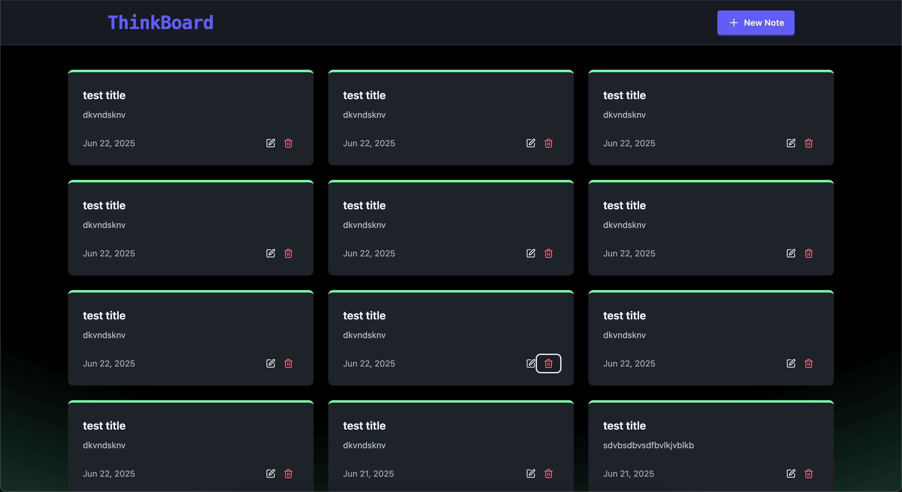

# Byte Docs

A full-stack note-taking application with a modern React frontend and a robust Express/MongoDB backend. Byte Docs lets you create, view, edit, and delete notes with a clean, responsive UI and includes rate limiting for fair API usage.

---

## Features

- 📝 **Create, view, edit, and delete notes**
- ⚡ **Fast, modern UI** built with React, Tailwind CSS, and DaisyUI
- 🔒 **Rate limiting** using Upstash to prevent abuse
- 🌐 **RESTful API** with Express.js and MongoDB
- 📱 **Responsive design** for desktop and mobile
- 🚦 **Error handling** and user feedback with toasts

---

## Tech Stack

**Frontend:**
- React 19
- Vite
- Tailwind CSS & DaisyUI
- Axios
- React Router

**Backend:**
- Node.js & Express.js
- MongoDB (via Mongoose)
- Upstash (Redis) for rate limiting
- CORS, dotenv

---

## Getting Started

### Prerequisites
- Node.js (v18+ recommended)
- npm or yarn
- MongoDB database (local or [MongoDB Atlas](https://www.mongodb.com/cloud/atlas))
- Upstash Redis account (for rate limiting)

### 1. Clone the repository
```bash
git clone https://github.com/yourusername/byte-docs.git
cd byte-docs
```

### 2. Setup Environment Variables
Create a `.env` file in `backend/` with:
```env
MONGODB_URI=your_mongodb_connection_string
UPSTASH_REDIS_REST_URL=your_upstash_redis_url
UPSTASH_REDIS_REST_TOKEN=your_upstash_redis_token
```

### 3. Install Dependencies
#### Backend
```bash
cd backend
npm install
```
#### Frontend
```bash
cd ../byte-docs
npm install
```

### 4. Run the App
#### Start Backend
```bash
cd backend
npm run dev
```
#### Start Frontend
```bash
cd ../byte-docs
npm run dev
```

- Frontend: [http://localhost:5173](http://localhost:5173)
- Backend API: [http://localhost:3000/api/notes](http://localhost:3000/api/notes)

---

## API Endpoints

| Method | Endpoint              | Description           |
|--------|-----------------------|-----------------------|
| GET    | /api/notes            | Get all notes         |
| GET    | /api/notes/:id        | Get a single note     |
| POST   | /api/notes            | Create a new note     |
| PUT    | /api/notes/:id        | Update a note         |
| DELETE | /api/notes/:id        | Delete a note         |

All endpoints are rate-limited (5 requests per minute per IP).

---

## Screenshots

### Dashboard


---
